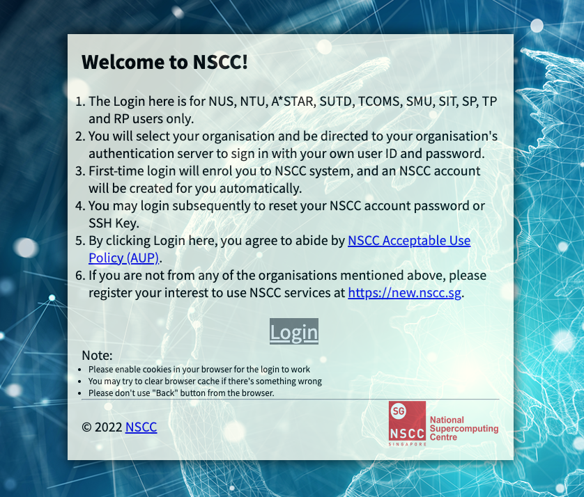
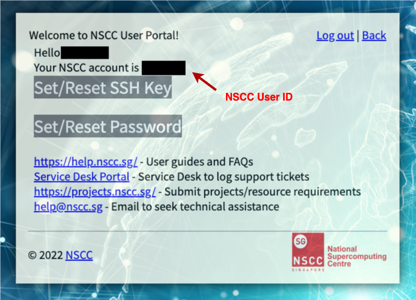

# NSCC Guide

## 1. Get an Account

<https://user.nscc.sg/saml/>



After creating your account you should see the dashboard.




## 2. Connect to the Systems

### If you are outside the NTU network

1. Connect to the NTU VPN. To get access to the NTU VPN refer to [this guide](https://www3.ntu.edu.sg/cits2/ras/for_cms_ref/GlobalProtectVPN.pdf).

2. Access the NTU Jump Host. Refer to [this guide](https://entuedu.sharepoint.com/teams/ntuhpcusersgroup2/SitePages/Using-NTU-JumpHost-to-NSCC-ASPIRE-2A.aspx) for detailed instructions. **First-time users** should email <hpcsupport@ntu.edu.sg> to request access.

3. Run the following command from the Jump Host. Replace `<userid>` with your **NSCC (not NTU)** user ID.

**Aspire 2A:**
```bash
ssh <userid>@aspire2antu.nscc.sg
```

**Aspire 2A+:**
```bash
ssh <userid>@aspire2pntu.nscc.sg
```

## 3. Transfer Files / Connect to NSCC in Visual Studio Code

### Between Your Computer and NSCC Systems

**Recommended Tools:** [FileZilla](https://filezilla-project.org/) or [WinSCP](https://winscp.net/eng/index.php) or [Visual Studio Code](https://code.visualstudio.com/) (Recommended)

### Visual Studio Code Setup

1. Press `Ctrl-Shift-P` (or `Cmd-Shift-P` on Mac)


2. Press "Add New SSH Host" / "Configure SSH Hosts"

3. Add these two for VPN and NSCC Cluster


## 4. Storage Setup

Your Home directory has a strict limit (50GB). Do not run big jobs or build containers here. Always work in your Scratch directory (100TB limit).

```bash
cd scratch
```

## 5. Making Containers

### What is a container?

A container is a standard unit of software that packages up code and all its dependencies, so the application runs quickly and reliably from one computing environment to another.

### The Workflow: Pull, Convert, Run

We rarely build containers from scratch on a cluster. Instead, we **pull** existing ones (like "[Alpine](https://hub.docker.com/_/alpine)") from the internet and run them.

#### 1. Load the Tool

First, we must make the Singularity software available in our environment.

```bash
module load singularity
```

#### 2. Pull and Convert (The Setup)

We download the "[Alpine](https://hub.docker.com/_/alpine)" container from Docker Hub. Singularity automatically **converts** the Docker format into a **SIF** (Singularity Image Format) file.

- **Input:** `docker://alpine:latest` (A web address for the container)
- **Output:** `alpine.sif` (A single file on your hard drive)

```bash
singularity pull alpine.sif docker://alpine:latest
```

#### 3. Execute (The Action)

Now, we run a command **inside** that SIF file. The command echo runs inside the container's isolated environment, not on the host computer. It wakes up the Alpine OS, prints the message, and instantly shuts down.

```bash
singularity exec alpine.sif echo "Hello! Singularity is working."
```
Here is what you should see:


## 6. Running a Real Runtime with Python

### 1. Download the official Python image

- `python:3.9-slim`: This tag tells Docker Hub to give us Python version 3.9. The word "slim" gives us a lightweight version without unnecessary tools, keeping the file size small (~50MB).

```bash
singularity pull python.sif docker://python:3.9-slim
```

### 2. Run a Python command inside the container

- **-c**: This flag stands for **"Command"**. This runs the code inside the quote marks immediately.

```bash
singularity exec python.sif python3 -c "print('Python container success! 3 + 4 =', 3+4)"
```
Here is what you should see:


## 7. Running vLLM

### 1. Firstly, create and activate a new environment 
### 2. Then pip install vLLM 
```
pip install vllm
```
### 3. Save this as a python file 
```python
from vllm import LLM,SamplingParams

llm=LLM('meta-llama/Llama-2-7b-hf', gpu_memory_utilization=0.7) 
params=SamplingParams(max_token=128,temperature=0.7)
outputs=llms.generate(['What is cake?'],params)

print(outputs[0].outputs[0].text.strip())
```
### 4. Create a Job Script

```bash
#!/bin/bash
#PBS -N Cake-test

#PBS -l select=1:ngpus=1:mem=400gb
#PBS -l walltime=04:00:00
#PBS -j oe
#PBS -P personal-<Add your own uid>
#PBS -q normal
cd $PBS_O_WORKDIR

module load miniforge3

source ~/anaconda3/etc/profile.d/conda.sh
conda activate vllm_env

python yourfilename.py
```

### 5.Submit the Job
```bash
qsub test.sh
```

### 6.Check Status
Use qstat to check if your job is queued (Q), running (R), or finished. Replace <id> with your username.
```bash
qstat -u <your_username>
```

## References

<https://nsccsg.github.io/>
